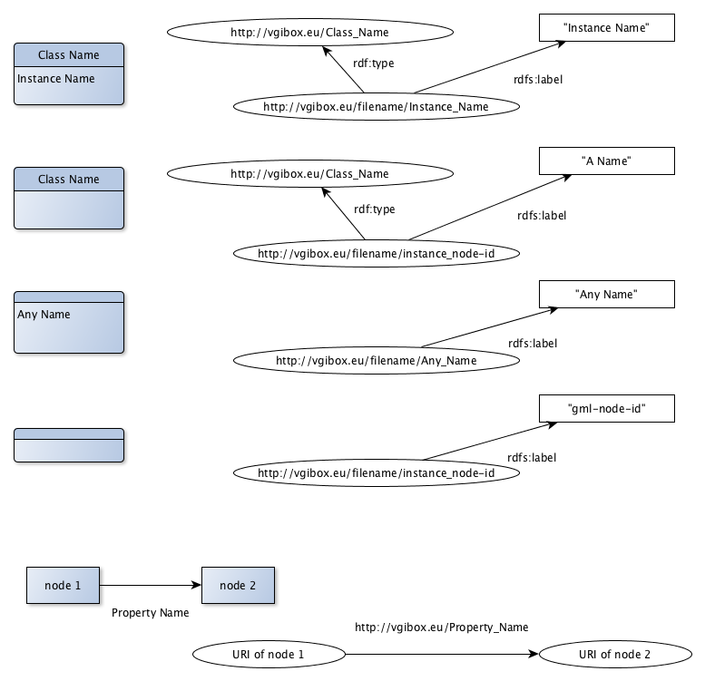

# graphml2rdf

This xsl stylesheets transforms a graphml file produced by yEd using the Entity-Relationship elements into an RDF graph.

The graph must be composed of 'Entity with Attributes' nodes (from the Entity-Relationship palette in yEd)

  - the Entity field (top) must contain a class name (or empty)
  - the Attributes field (bottom) must contain an instance name (or empty)
  
To run the transformation tool

  1. Download graphml2rdf.xsl and saxon9he.jar (the Saxon xml library)
  2. Execute the following command:

    java -jar saxon9he.jar -xsl:graphml2rdf.xsl graphml-file > rdf-file
   
The output file is an RDF/XML file. It can be directly uploaded into a triple store.

#### Transformation principles

 

The instance names generate "local" URIs, based on the input file name.  Thus several generated RDF files can be uploaded in an endpoint without mixing up the instance names. The class names generate "global" URIs, independent of the source file. So the same class name appearing in different graphml graphs will generate the same URI. In this sense class names are global.
